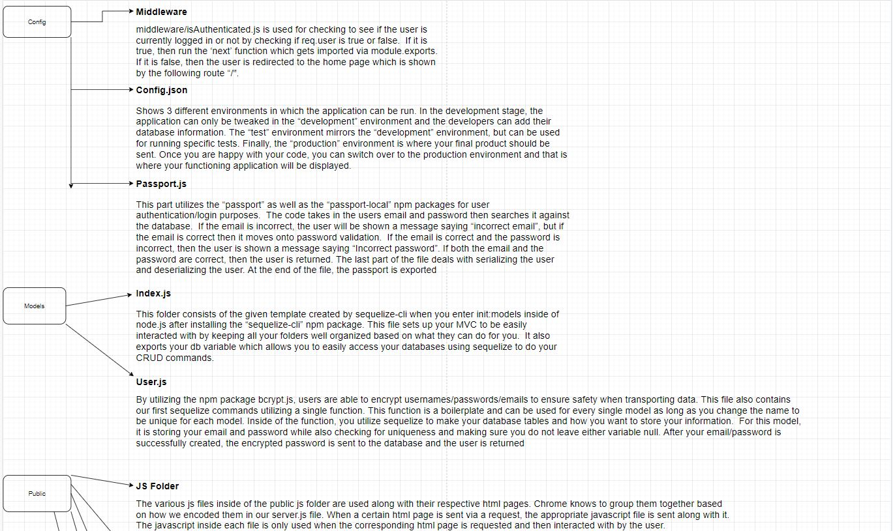

# Sequelize: Reverse Engineering Code

Reverse engineer the starter code provided and create a tutorial for the code.

In the `Develop` folder, there is starter code for a project. Begin inspecting the code to get an understanding of each file's responsibility. Then create a tutorial explaining *every* file and its purpose. To view my unique approach to *diagramming* this out, please click the following link:https://drive.google.com/file/d/1qCHBYM7gOAmgrWOT5HNunxYo3f8mQY-S/view?usp=sharing

At the end of the tutorial, add instructions for how you could now add changes to this project.

## User Story

```
AS A developer

I WANT a walk-through of the codebase

SO THAT I can use it as a starting point for a new project
```

## Business Context

When joining a new team, you will be expected to inspect a lot of code that you have never seen before. Rather than having a team member explain every line for you, you will dissect the code by yourself, saving any questions for a member of your team.

## Acceptance Criteria

```
GIVEN a Node.js application using Sequelize and Passport
WHEN I follow the walkthrough
THEN I understand the codebase
```

## Contributors

| Chandler
------------ 

[<br /><sub><b>Chandler Lowrance</b></sub>](https://github.com/Chandler8)<br />[💻](https://github.com/Chandler8?tab=repositories "Repositories")

## Images

